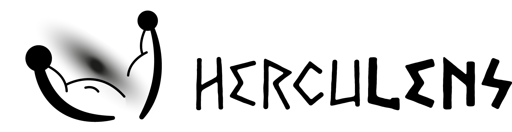

# Herculens: differentiable gravitational lensing


[](https://github.com/austinpeel/herculens/actions/workflows/ci_tests.yml)
[](https://arxiv.org/abs/2207.05763)

<!--  -->
<!-- [](https://coveralls.io/github/aymgal/utax?branch=main) -->


## Analysis of strong lensing imaging data

The primary purpose of `herculens` is to provide flexible modeling methods to model current and future observations of strong gravitational lenses. Currently, it supports various degrees of model complexity, ranging from standard smooth analytical profiles to pixelated models combined with machine learning approaches.

Currently, `herculens` supports several of the most widely-used analytical profiles, as well as multi-scale pixelated models regularized with wavelets. Future updates will include the support of point source modeling, new regularization techniques, and more expressive models based on neural networks.


## `JAX`-based automatic differentiation and code compilation 

`herculens` is based on the powerful framework of **differentiable programming**. The code is entirely based on the automatic differentiation and compilation features of [JAX](https://jax.readthedocs.io/en/latest/#). This simply means that you have access, _analytically_, to all partial derivatives of your model with respect to any of its parameters. This enables faster convergence to the solution, more efficient exploration of the parameter space including the sampling of posterior distributions, and new ways to mitigate degeneracies that affect gravitational lensing.

This highly modular framework offers a way to merge all modeling paradigms explored in the literature, into a single tool:

- **analytical**: model components are described by analytical functions with few parameters and clear physical meaning, but that may be insufficient to fit all observations;
- **pixelated**: regular or irregular grid of pixels are used as individual parameters, which offer higher flexibility, but requires well-motivated regularization strategies;
- **deep learning**: neural networks (among others) are by construction fully differentiable, regardless of being pre-trained or not. It is therefore effortless to plug-in any deep learning-based model component to `herculens`.


## Example notebooks

Below you can find a few examples of synthetic problems that can be tackled with `herculens`:

- [**Starting guide**: Lens modeling with gradient descent, Fisher analysis and Hamiltonian sampling](https://github.com/aymgal/herculens_workspace/blob/main/notebooks/herculens__Starting_guide.ipynb)
- [Starting guide with a complex source: similar to the starting guide but with a more complex source galaxy](https://github.com/aymgal/herculens_workspace/blob/main/notebooks/herculens__Starting_guide.ipynb)
- [Reconstruction of a complex lensed galaxy with wavelets (and analytical profiles)](https://github.com/aymgal/herculens_workspace/blob/main/notebooks/herculens__Complex_source_with_wavelets.ipynb)
- [Detection of a dark satellite as a localized deviation to the smooth lens potential](https://github.com/aymgal/herculens_workspace/blob/main/notebooks/herculens__Subhalo_detection_with_wavelets.ipynb)
- [Bayesian wavelet modeling of a spiral galaxy with (Laplace) sparsifying priors](https://github.com/aymgal/herculens_workspace/blob/main/notebooks/herculens__Spiral_galaxy_Bayesian_sparsity_Laplace.ipynb)
- [Simple smooth light profile fitting](https://github.com/aymgal/herculens_workspace/blob/main/notebooks/herculens__Simple_galaxy_fitting.ipynb)

New notebooks will continuously be added in order to showcase other features of the package and apply those in different situations.


## Installation

### Manual installation

The package will be soon available through PyPi directly, but it is as easy to install it manually. It has been texted against Python 3.7, but should work with Python 3.8 or more recent versions.

Good practice is to create a new python environment:
```sh
conda create -n herculens-env python=3.7
conda activate herculens-env
```

Download the package `cd` into the directory. Then install the local `herculens` package (or use `-e` for a development install) as follows:
```sh
pip install (-e) .
```

The following dependencies will be installed automatically.


### External package requirements

The [`requirements.txt`](requirements.txt) file lists all required and optional package dependencies, along with their specific versions.


## Attribution

### Citation

If you make use of `herculens`, please cite [Galan et al. 2022](https://arxiv.org/abs/2207.05763). This work presents the global architecture of the tool, and applies it to reconstruct a pixelated lens potential with wavelets.
```
@article{Galan:2022:herculens,
    author        = "Galan, Aymeric and Vernardos, Georgios and Peel, Austin and Courbin, Fr\'ed\'eric and Starck, Jean-Luc",
    title         = "{Using wavelets to capture deviations from smoothness in galaxy-scale strong lenses}",
    eprint        = "2207.05763",
    archivePrefix = "arXiv",
    primaryClass  = "astro-ph.CO",
    year          = "2022"
}
```


### Special mention regarding Lenstronomy
Part of the `herculens` code originates from the open-source lens modeling software package [`lenstronomy`](https://github.com/sibirrer/lenstronomy), described in [Birrer et al. 2021](https://joss.theoj.org/papers/10.21105/joss.03283) (and references therein). In every source file, proper credits are given to the specific developers and contributors to both the original `lenstronomy` (up to version 1.9.3) and `herculens`.


### Contributors

The list of people that contributed to `Herculens` and credits to original `lenstronomy` contributors, is in [this document](AUTHORS.md).
