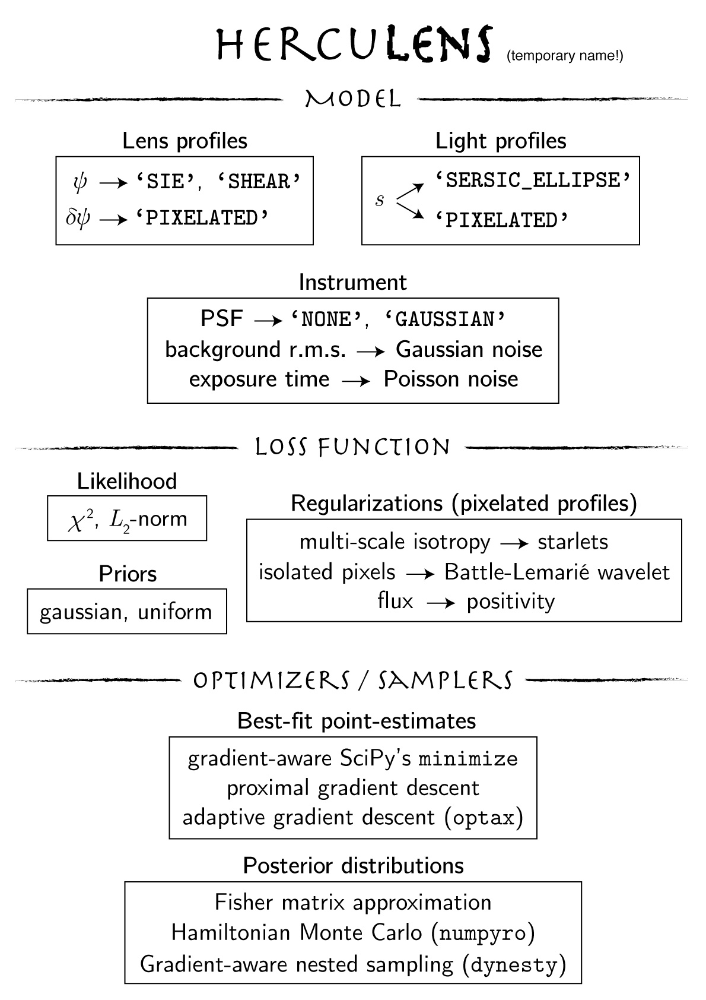

# jax-strong-lensing

## JAX-enabled autodifferentiable strong lens modelling



### Recommended Usage
First create an independent python environment.
```sh
conda create -n jax-strong-lensing python=3.7
conda activate jax-strong-lensing
```

Then pip install (develop) the local `jaxtronomy` package.
```sh
pip install (-e) .
```

The following dependencies will be installed automatically.

### Requirements (tested version)
- `numpy` (1.20.3)
- `scipy` (1.6.3)
- `jax` (0.2.13)
- `jaxlib` (0.1.67)

##### Optional
- `corner` (2.2.1), for corner plots
- `numpyro` (0.7.1), for HMC sampling
- `emcee` (3.0.2), for MCMC
- `jaxns` (0.0.7), for `jax`-enabled nested sampling
- `dynesty` (1.1), for nested sampling using Hamiltonian slice sampling
- `lenstronomy` (1.6.0), for particle swarm optimization (this might be removed in the future)

To run the notebooks, `jupyter` is (of course) also necessary, along with `matplotlib` for plotting.

### Notes
The foundation of the `jaxtronomy` package implemented here comes from [`lenstronomy`](https://github.com/sibirrer/lenstronomy), a popular strong
gravitational lens modelling software. The original code has been trimmed to the minimum necessary for our purposes. Modifications have been made throughout, primarily to allow JAX autodiff to operate through the workflow. Many stylistic changes have been made as well. The basic module structure, however, remains largely the same.
